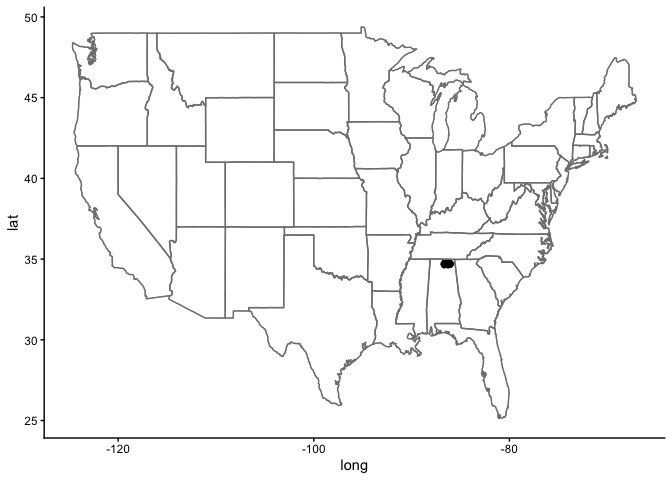
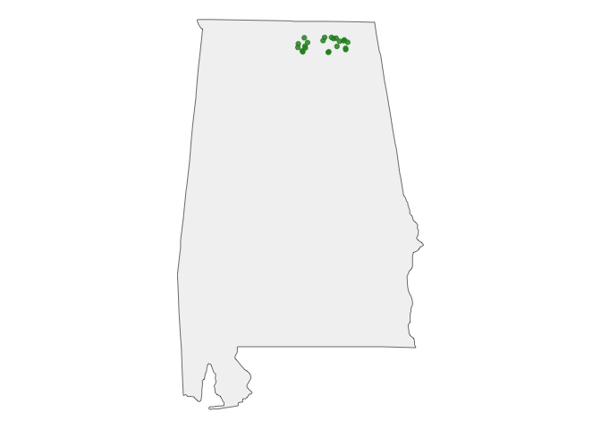
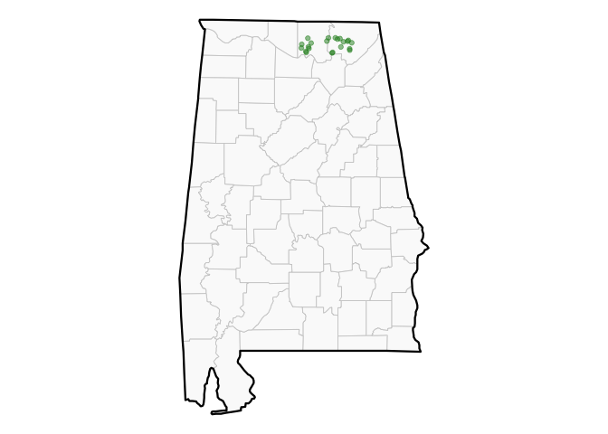
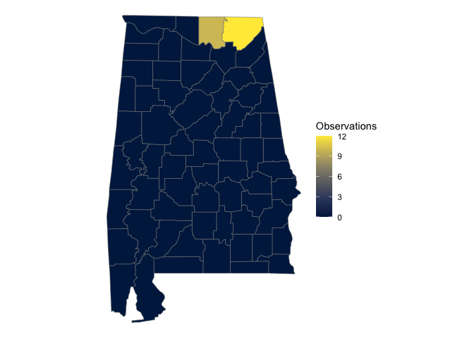
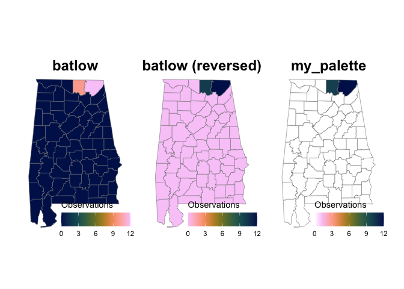

# Trusting iNat Observations
BioCuration Lab

- [Establishing Your “Trusted” Users](#establishing-your-trusted-users)
- [Finding observations identified by trusted
  users…](#finding-observations-identified-by-trusted-users)
- [Create a Map](#create-a-map)
  - [Add counties](#add-counties)
- [Dealing with Uncertainty](#dealing-with-uncertainty)
  - [Getting Accurate Coordinates](#getting-accurate-coordinates)
  - [Chloropleth Map](#chloropleth-map)
  - [Bonus! Thinking of
    accessibility…](#bonus-thinking-of-accessibility)
- [Packages Used](#packages-used)

``` r
if (!require("pacman")) install.packages("pacman"); library(pacman)
p_load(rinat, dplyr, stringr, tibble, ggplot2, sf, maps, patchwork, scico, gt, 
       httr2, purrr,
       tidyr,
       install = TRUE, update = FALSE)
```

The R package [`{rinat}`](https://github.com/ropensci/rinat) was made
for interacting directly with the [iNaturalist
API](https://api.inaturalist.org/v1/docs/).

> [!TIP]
>
> If you run into any limitations, you could likely make a custom
> solution to the iNat API using {httr2}(https://httr2.r-lib.org).

A useful vignette to get started…

``` r
vignette("rinat-intro", package = "rinat")
```

The quickest way is to search with `get_inat_obs()`.

You can refine the search using parameters. - `place_id` - `quality` -
`taxon_name` - searches for it and all its descendants

I’m not sure if there’s a better way to do it, but I know that the iNat
website has additive URLs. If I go to the normal *Explore* page, type in
`Alabama`, hit search, and check the resulting URL… it looks like this:
<https://www.inaturalist.org/observations?place_id=19>. Thus, I assume
that the place_id for Alabama is 19.

``` r
obs <- get_inat_obs(
  taxon_name = "Orconectes australis",
  place_id = 19,
  quality = "research" # Only return research-grade observations
)
```

The `obs` object returns a ton of information…

``` r
names(obs)
```

     [1] "scientific_name"                  "datetime"                        
     [3] "description"                      "place_guess"                     
     [5] "latitude"                         "longitude"                       
     [7] "tag_list"                         "common_name"                     
     [9] "url"                              "image_url"                       
    [11] "user_login"                       "id"                              
    [13] "species_guess"                    "iconic_taxon_name"               
    [15] "taxon_id"                         "num_identification_agreements"   
    [17] "num_identification_disagreements" "observed_on_string"              
    [19] "observed_on"                      "time_observed_at"                
    [21] "time_zone"                        "positional_accuracy"             
    [23] "public_positional_accuracy"       "geoprivacy"                      
    [25] "taxon_geoprivacy"                 "coordinates_obscured"            
    [27] "positioning_method"               "positioning_device"              
    [29] "user_id"                          "user_name"                       
    [31] "created_at"                       "updated_at"                      
    [33] "quality_grade"                    "license"                         
    [35] "sound_url"                        "oauth_application_id"            
    [37] "captive_cultivated"              

This information includes user attributes. If you have a list of people
you trust to make the IDs, you can easily limit the `obs` object by any
of these user attributes.

``` r
obs %>%
  select(contains("user")) %>%
  names()
```

    [1] "user_login" "user_id"    "user_name" 

I’d recommend using either `user_login` or `user_name`. `user_id` may be
a safer choice in the long run because it’ll never change, but you’d
need to pull it from iNat — that could be really annoying!

## Establishing Your “Trusted” Users

Let’s say you have a list of “trusted” users stored in a spreadsheet.
For this example, I’m going to use the iNat IDs from these people
providing their `user_login`…

1.  Import the trusted users

    ``` r
    # trusted_users <- read.csv(...)

    trusted_users <- tibble(
      # Directly corresponds to iNaturalist field
      user_login = c("hydrophilus", "niemillernature", "kingjenna"),

      # Does NOT correspond to iNaturalist field
      name = c("Eric Maxwell", "Matt Niemiller", "Jenna King"),

      # Does NOT correspond to iNaturalist field
      affiliation = c(NA, "University of Alabama, Huntsville", "USFWS")
    )
    ```

    ``` r
    trusted_users
    ```

        # A tibble: 3 × 3
          user_login      name           affiliation                      
          <chr>           <chr>          <chr>                            
        1 hydrophilus     Eric Maxwell   <NA>                             
        2 niemillernature Matt Niemiller University of Alabama, Huntsville
        3 kingjenna       Jenna King     USFWS                            

2.  **Filter the rows in `obs` that match the `user_login` from the
    `trusted_users` data.frame.**

    ``` r
    filtered_obs <- obs %>%
      filter(user_login %in% trusted_users$user_login)
    ```

    Do a small sanity check to make sure your filter actually worked…

    ``` r
    # All observations...
    nrow(obs)
    ```

        [1] 57

    ``` r
    # Observations only by trusted users...
    nrow(filtered_obs)
    ```

        [1] 22

> [!IMPORTANT]
>
> Use `filtered_obs` to pull any pertinent information you want for
> downstream analyses.

## Finding observations identified by trusted users…

This is going to be the “same” query as what I did above with rinat, but
since I want to know more about who identified them, I need to do an API
request with `{httr2}`. See the full list of potential parameters in the
[iNaturalist API v2
documentation](https://api.inaturalist.org/v2/docs/#/Observations/get_observations).

``` r
# 1. Prepare the request
req <- request("https://api.inaturalist.org/v2/observations") |>
  req_url_query(
    taxon_name = "Orconectes australis",
    place_id = 19,
    quality_grade = "research", # Only return research grade observations
    # What fields should be returned?
    fields = "all"
  )

# 2. Execute the request
resp <- req_perform(req)
data <- resp_body_json(resp, simplifyVector = TRUE)

# 3. Prep results to use
obs_api <- data$results
```

``` r
names(obs_api)
```

     [1] "id"                                "annotations"                      
     [3] "application"                       "cached_votes_total"               
     [5] "captive"                           "comments"                         
     [7] "comments_count"                    "community_taxon_id"               
     [9] "created_at"                        "created_at_details"               
    [11] "created_time_zone"                 "description"                      
    [13] "faves"                             "faves_count"                      
    [15] "flags"                             "geojson"                          
    [17] "geoprivacy"                        "ident_taxon_ids"                  
    [19] "identifications"                   "identifications_count"            
    [21] "identifications_most_agree"        "identifications_most_disagree"    
    [23] "identifications_some_agree"        "license_code"                     
    [25] "location"                          "map_scale"                        
    [27] "mappable"                          "non_owner_ids"                    
    [29] "num_identification_agreements"     "num_identification_disagreements" 
    [31] "oauth_application_id"              "obscured"                         
    [33] "observation_photos"                "observed_on"                      
    [35] "observed_on_details"               "observed_on_string"               
    [37] "observed_time_zone"                "ofvs"                             
    [39] "outlinks"                          "owners_identification_from_vision"
    [41] "photos"                            "place_guess"                      
    [43] "place_ids"                         "positional_accuracy"              
    [45] "preferences"                       "project_ids"                      
    [47] "project_ids_with_curator_id"       "project_ids_without_curator_id"   
    [49] "project_observations"              "public_positional_accuracy"       
    [51] "quality_grade"                     "quality_metrics"                  
    [53] "reviewed_by"                       "site_id"                          
    [55] "sounds"                            "spam"                             
    [57] "species_guess"                     "tags"                             
    [59] "taxon"                             "taxon_geoprivacy"                 
    [61] "time_observed_at"                  "time_zone_offset"                 
    [63] "updated_at"                        "uri"                              
    [65] "user"                              "uuid"                             
    [67] "votes"                            

``` r
# Exploring where stuff is at. This isn't super important to an end user.
class(obs_api$identifications)
class(obs_api$identifications[[1]]$user$login)
names(obs_api$identifications[[1]])

obs_api$taxon$name
obs_api$identifications[[1]]$taxon$name
obs_api$identifications[[1]]$user$login
```

1.  **Reshape identificaiton data**

``` r
obs_tbl <- tibble(
  obs_id = obs_api$id, # observationID (not identificationID)
  identifications = obs_api$identifications
) %>%
  mutate(
    # Get all user logins associated with an observation
    logins = purrr::map(identifications, ~ .x$user$login)
    ) %>%
  # Expand so each row = one user login per observation
  unnest(logins) %>%
  rename(user_login = logins)
```

**What this does:** \* `obs_api$identifications` is a list where each
element contains multiple IDs per observation. \* `map()` extracts a
complete vector of user logins that made IDs for an observation \*
`unnest()` converts the nested list structure into a flattened table -
i.e., One row per observation x ID-er \* Result: a tidy table
(`obs_tbl`) with columns: - obs_id - user_login

2.  **Identify observations with trusted users**

``` r
trusted_identifications <- obs_tbl %>%
  filter(user_login %in% trusted_users$user_login) %>%
  distinct(obs_id) %>%
  pull()

message(paste("There are", length(trusted_identifications), "iNat observations identified by trusted users.", sep = " " ))
```

    There are 26 iNat observations identified by trusted users.

4.  **Subset the original dataset…**

``` r
trusted_observations <- obs_api %>%
  filter(id %in% trusted_identifications)
```

``` r
# Sanity check -- this should = TRUE
setequal(trusted_identifications, trusted_observations$id)
```

    [1] TRUE

## Create a Map

`{rinat}` includes a mapping function that returns a ggplot map object,
but you may choose to create your own with other tools.

``` r
map <- inat_map(filtered_obs, plot = FALSE)

map + 
  annotation_borders("state") + 
  theme_classic()
```



That map sucks. It might depend on what your input is, but I’d like to
make a better one…

``` r
library(sf)
library(maps)
```

0.  **Define target state**

    ``` r
    target_state <- "alabama"
    ```

    *This is done purely for the easy reuse of code.*

1.  **Fetch target state boundary**

    ``` r
    state_boundary <- st_as_sf(maps::map("state", 
                                   regions = target_state, 
                                   fill = TRUE, plot = FALSE)) |>
                      st_set_crs(4326)
    ```

        Warning: st_crs<- : replacing crs does not reproject data; use st_transform for
        that

2.  **Convert inat data into an sf spatial object**

    ``` r
    inat_sf <- st_as_sf(filtered_obs, coords = c("longitude", "latitude"), crs = 4326)
    ```

3.  **Filter points to only keep the ones inside the boundary**

    ``` r
    state_filtered_obs <- st_intersection(inat_sf, state_boundary)
    ```

        Warning: attribute variables are assumed to be spatially constant throughout
        all geometries

    ``` r
    # Optional sanity check
    nrow(state_filtered_obs)
    ```

        [1] 22

    ``` r
    nrow(filtered_obs)
    ```

        [1] 22

4.  **Plot it!**

    ``` r
    ggplot() +
      geom_sf(data = state_boundary, fill = "gray95", color = "black") +
      geom_sf(data = state_filtered_obs, color = "forestgreen", alpha = 0.8) + 
      theme_void()
    ```

    

### Add counties

1.  Fetch county boundaries, filtered by target state

    ``` r
    counties <- st_as_sf(maps::map("county", fill = TRUE, plot = FALSE)) %>%
      filter(grepl(target_state, ID)) |>
      st_set_crs(4326)
    ```

    > [!NOTE]
    >
    > We already have the state boundary from [above](@state-boundary),
    > so there’s no need to generate it again.

2.  Plot it!

    ``` r
    ggplot() +
      # Layer 1: County polygons with light borders
      geom_sf(data = counties, fill = "gray98", color = "gray80", size = 0.3) +

      # Layer 2: State outline (thick)
      geom_sf(data = state_boundary, fill = NA, color = "black", size = 0.8) +

      # Layer 3: Occurrence points 
      geom_sf(data = state_filtered_obs, color = "forestgreen", alpha = 0.5, size = 1.5) + 

      # Clean up background
      theme_void()
    ```

    

## Dealing with Uncertainty

You should be aware that the coordinates of iNat observations may be
obscured. This can be determined on a by-record basis from the
`coordinates_obscured` field which reflects the user’s flagging (i.e.,
`geoprivacy`) and the iNat system designation (i.e.,
`taxon_geoprivacy`).

The “uncertainty” is recorded in `positional_accuracy` and
`public_positional_accuracy`.

> [!IMPORTANT]
>
> To get the accurate coordinates, you would need to have the API return
> `private_latitude` and `private_longitude`. This requires establishing
> authentication AND being an authorized user (e.g., the observer, a
> “trusted user” of the observer’s account, a project curator).
>
> `**{rinat}**` does *not* support authentication.

### Getting Accurate Coordinates

As mentioned before, you need to be an authorized user (e.g., the
observer, a “trusted user” of the observer’s account, a project
curator).

#### Generate iNaturalist API Token

> [!NOTE]
>
> The steps detailed here generate a temporary (24-hour) token. I can
> work on an automation for it, but it requires the “app” to be
> registered with iNaturalist first. It won’t be much of a hassle to do
> that, but it’ll a little more time to pull the info for the
> application together.

Go to
[inaturalist.org/users/api_token](https://www.inaturalist.org/users/api_token).
Then copy the complete string starting with `ey...` to your clipboard.

To avoid hardcoding the token directly in a script where it could be
accidentally shared, you should save it as an environment variable. Open
your user environment file…

``` r
if (!require("usethis")) install.packages("usethis")

usethis::edit_r_environ()
```

A text file called `.Renviron` will open in the editor (assuming you’re
using RStudio or another IDE). Add your token on a new line like this…

`INAT_TOKEN="paste_your_copied_token_here"`

Restart the R session for the changes to take effect.

``` r
rstudioapi::restartSession()
```

> [!WARNING]
>
> If you use Git/ GitHub, make sure your `.gitignore` file includes
> `.Renviron` so your token never leaves your computa!

#### Fetch Obscured Data with `httr2`

Once your token is generated (see [Generate iNaturalist API
Token](#generate-inat-token)), you can use use `Sys.getenv()` to query
with the token securely within a script.

See [iNaturalist v2 API](https://api.inaturalist.org/v2/docs/)

``` r
library(httr2)
library(jsonlite)
```


    Attaching package: 'jsonlite'

    The following object is masked from 'package:purrr':

        flatten

``` r
# 1. Load token from .Renvir
my_jwt <- Sys.getenv("INAT_TOKEN")

# 2. Construct request targeting iNat v2 API
# -- Note: v2 requires you explicitly state what fields to return
req <- request("https://api.inaturalist.org/v2/observations") |>
  req_url_query(
    user_id = "emmerson_cray",
    geoprivacy = "obscured",
    fields = "all"
  ) |>
  # Pass the token as a Bearer string in the Authorization header
  req_headers(Authorization = my_jwt)

# 3. Execute the request
resp <- req_perform(req)
data <- resp_body_json(resp, simplifyVector = TRUE)

# 4. View results with real, hidden spatial locations intact
my_obs_df <- data$results
```

> [!NOTE]
>
> You can specify `fields = "all"` to return every single option, or be
> selective in the ones you want (e.g.,
> `fields = "species_guess,observed_on,location,private_location,..."`)

Here are all the fields the call above will return:

``` r
names(my_obs_df)
```

     [1] "id"                                "annotations"                      
     [3] "application"                       "cached_votes_total"               
     [5] "captive"                           "comments"                         
     [7] "comments_count"                    "community_taxon_id"               
     [9] "created_at"                        "created_at_details"               
    [11] "created_time_zone"                 "description"                      
    [13] "faves"                             "faves_count"                      
    [15] "flags"                             "geojson"                          
    [17] "geoprivacy"                        "ident_taxon_ids"                  
    [19] "identifications"                   "identifications_count"            
    [21] "identifications_most_agree"        "identifications_most_disagree"    
    [23] "identifications_some_agree"        "license_code"                     
    [25] "location"                          "map_scale"                        
    [27] "mappable"                          "non_owner_ids"                    
    [29] "num_identification_agreements"     "num_identification_disagreements" 
    [31] "oauth_application_id"              "obscured"                         
    [33] "observation_photos"                "observed_on"                      
    [35] "observed_on_details"               "observed_on_string"               
    [37] "observed_time_zone"                "ofvs"                             
    [39] "outlinks"                          "owners_identification_from_vision"
    [41] "photos"                            "place_guess"                      
    [43] "place_ids"                         "positional_accuracy"              
    [45] "preferences"                       "private_geojson"                  
    [47] "private_location"                  "private_place_guess"              
    [49] "project_ids"                       "project_ids_with_curator_id"      
    [51] "project_ids_without_curator_id"    "project_observations"             
    [53] "public_positional_accuracy"        "quality_grade"                    
    [55] "quality_metrics"                   "reviewed_by"                      
    [57] "site_id"                           "sounds"                           
    [59] "spam"                              "species_guess"                    
    [61] "tags"                              "taxon"                            
    [63] "taxon_geoprivacy"                  "time_observed_at"                 
    [65] "time_zone_offset"                  "updated_at"                       
    [67] "uri"                               "user"                             
    [69] "uuid"                              "viewer_trusted_by_observer"       
    [71] "votes"                            

If you aren’t being returned private fields, it’s probably because your
token is invalid. See [Troubleshoot Your Token](#troubleshoot-token) for
help.

#### Fetch *Specific* Obscured Data with httr2

Since I won’t have “trusted” access to the obscured coordinates from
`filtered_obs`, I’ll send an **unauthenticated** request to retrieve the
observations by my user `emmerson_cray`…

``` r
req_unauthenticated <- request("https://api.inaturalist.org/v2/observations") |>
  req_url_query(
    user_id = "emmerson_cray",
    fields = "all"
  )

resp_unauthenticated <- req_perform(req_unauthenticated)
data_unauthenticated <- resp_body_json(resp_unauthenticated, simplifyVector = TRUE)

my_obs_unauthenticated <- data_unauthenticated$results
```

And to compare the difference, I’ll send an **authenticated** request to
retrieve the observation by my user `emmerson_cray`…

``` r
my_jwt <- Sys.getenv("INAT_TOKEN")

req_authenticated <- request("https://api.inaturalist.org/v2/observations") |>
  req_url_query(
    user_id = "emmerson_cray",
    fields = "all"
  ) |>
  req_headers(Authorization = my_jwt)

resp_authenticated <- req_perform(req_authenticated)
data_authenticated <- resp_body_json(resp_authenticated, simplifyVector = TRUE)

my_obs_authenticated <- data_authenticated$results
```

The API silently removes the columns that require some sort of
authentication. We can tell by seeing the difference in the data frames…

``` r
# Unauthenticated
ncol(my_obs_unauthenticated)
```

    [1] 67

``` r
# Authenticated
ncol(my_obs_authenticated)
```

    [1] 71

The exact columns that require authentication *(for this type of
request)* are…

``` r
library(janitor)
```


    Attaching package: 'janitor'

    The following objects are masked from 'package:stats':

        chisq.test, fisher.test

``` r
compare_df_cols(my_obs_unauthenticated, my_obs_authenticated) %>%
  filter(is.na(my_obs_unauthenticated)) |>
  select(column_name) |>
  gt()
```

<div id="faopmqlmmf" style="padding-left:0px;padding-right:0px;padding-top:10px;padding-bottom:10px;overflow-x:auto;overflow-y:auto;width:auto;height:auto;">
<style>#faopmqlmmf table {
  font-family: system-ui, 'Segoe UI', Roboto, Helvetica, Arial, sans-serif, 'Apple Color Emoji', 'Segoe UI Emoji', 'Segoe UI Symbol', 'Noto Color Emoji';
  -webkit-font-smoothing: antialiased;
  -moz-osx-font-smoothing: grayscale;
}
&#10;#faopmqlmmf thead, #faopmqlmmf tbody, #faopmqlmmf tfoot, #faopmqlmmf tr, #faopmqlmmf td, #faopmqlmmf th {
  border-style: none;
}
&#10;#faopmqlmmf p {
  margin: 0;
  padding: 0;
}
&#10;#faopmqlmmf .gt_table {
  display: table;
  border-collapse: collapse;
  line-height: normal;
  margin-left: auto;
  margin-right: auto;
  color: #333333;
  font-size: 16px;
  font-weight: normal;
  font-style: normal;
  background-color: #FFFFFF;
  width: auto;
  border-top-style: solid;
  border-top-width: 2px;
  border-top-color: #A8A8A8;
  border-right-style: none;
  border-right-width: 2px;
  border-right-color: #D3D3D3;
  border-bottom-style: solid;
  border-bottom-width: 2px;
  border-bottom-color: #A8A8A8;
  border-left-style: none;
  border-left-width: 2px;
  border-left-color: #D3D3D3;
}
&#10;#faopmqlmmf .gt_caption {
  padding-top: 4px;
  padding-bottom: 4px;
}
&#10;#faopmqlmmf .gt_title {
  color: #333333;
  font-size: 125%;
  font-weight: initial;
  padding-top: 4px;
  padding-bottom: 4px;
  padding-left: 5px;
  padding-right: 5px;
  border-bottom-color: #FFFFFF;
  border-bottom-width: 0;
}
&#10;#faopmqlmmf .gt_subtitle {
  color: #333333;
  font-size: 85%;
  font-weight: initial;
  padding-top: 3px;
  padding-bottom: 5px;
  padding-left: 5px;
  padding-right: 5px;
  border-top-color: #FFFFFF;
  border-top-width: 0;
}
&#10;#faopmqlmmf .gt_heading {
  background-color: #FFFFFF;
  text-align: center;
  border-bottom-color: #FFFFFF;
  border-left-style: none;
  border-left-width: 1px;
  border-left-color: #D3D3D3;
  border-right-style: none;
  border-right-width: 1px;
  border-right-color: #D3D3D3;
}
&#10;#faopmqlmmf .gt_bottom_border {
  border-bottom-style: solid;
  border-bottom-width: 2px;
  border-bottom-color: #D3D3D3;
}
&#10;#faopmqlmmf .gt_col_headings {
  border-top-style: solid;
  border-top-width: 2px;
  border-top-color: #D3D3D3;
  border-bottom-style: solid;
  border-bottom-width: 2px;
  border-bottom-color: #D3D3D3;
  border-left-style: none;
  border-left-width: 1px;
  border-left-color: #D3D3D3;
  border-right-style: none;
  border-right-width: 1px;
  border-right-color: #D3D3D3;
}
&#10;#faopmqlmmf .gt_col_heading {
  color: #333333;
  background-color: #FFFFFF;
  font-size: 100%;
  font-weight: normal;
  text-transform: inherit;
  border-left-style: none;
  border-left-width: 1px;
  border-left-color: #D3D3D3;
  border-right-style: none;
  border-right-width: 1px;
  border-right-color: #D3D3D3;
  vertical-align: bottom;
  padding-top: 5px;
  padding-bottom: 6px;
  padding-left: 5px;
  padding-right: 5px;
  overflow-x: hidden;
}
&#10;#faopmqlmmf .gt_column_spanner_outer {
  color: #333333;
  background-color: #FFFFFF;
  font-size: 100%;
  font-weight: normal;
  text-transform: inherit;
  padding-top: 0;
  padding-bottom: 0;
  padding-left: 4px;
  padding-right: 4px;
}
&#10;#faopmqlmmf .gt_column_spanner_outer:first-child {
  padding-left: 0;
}
&#10;#faopmqlmmf .gt_column_spanner_outer:last-child {
  padding-right: 0;
}
&#10;#faopmqlmmf .gt_column_spanner {
  border-bottom-style: solid;
  border-bottom-width: 2px;
  border-bottom-color: #D3D3D3;
  vertical-align: bottom;
  padding-top: 5px;
  padding-bottom: 5px;
  overflow-x: hidden;
  display: inline-block;
  width: 100%;
}
&#10;#faopmqlmmf .gt_spanner_row {
  border-bottom-style: hidden;
}
&#10;#faopmqlmmf .gt_group_heading {
  padding-top: 8px;
  padding-bottom: 8px;
  padding-left: 5px;
  padding-right: 5px;
  color: #333333;
  background-color: #FFFFFF;
  font-size: 100%;
  font-weight: initial;
  text-transform: inherit;
  border-top-style: solid;
  border-top-width: 2px;
  border-top-color: #D3D3D3;
  border-bottom-style: solid;
  border-bottom-width: 2px;
  border-bottom-color: #D3D3D3;
  border-left-style: none;
  border-left-width: 1px;
  border-left-color: #D3D3D3;
  border-right-style: none;
  border-right-width: 1px;
  border-right-color: #D3D3D3;
  vertical-align: middle;
  text-align: left;
}
&#10;#faopmqlmmf .gt_empty_group_heading {
  padding: 0.5px;
  color: #333333;
  background-color: #FFFFFF;
  font-size: 100%;
  font-weight: initial;
  border-top-style: solid;
  border-top-width: 2px;
  border-top-color: #D3D3D3;
  border-bottom-style: solid;
  border-bottom-width: 2px;
  border-bottom-color: #D3D3D3;
  vertical-align: middle;
}
&#10;#faopmqlmmf .gt_from_md > :first-child {
  margin-top: 0;
}
&#10;#faopmqlmmf .gt_from_md > :last-child {
  margin-bottom: 0;
}
&#10;#faopmqlmmf .gt_row {
  padding-top: 8px;
  padding-bottom: 8px;
  padding-left: 5px;
  padding-right: 5px;
  margin: 10px;
  border-top-style: solid;
  border-top-width: 1px;
  border-top-color: #D3D3D3;
  border-left-style: none;
  border-left-width: 1px;
  border-left-color: #D3D3D3;
  border-right-style: none;
  border-right-width: 1px;
  border-right-color: #D3D3D3;
  vertical-align: middle;
  overflow-x: hidden;
}
&#10;#faopmqlmmf .gt_stub {
  color: #333333;
  background-color: #FFFFFF;
  font-size: 100%;
  font-weight: initial;
  text-transform: inherit;
  border-right-style: solid;
  border-right-width: 2px;
  border-right-color: #D3D3D3;
  padding-left: 5px;
  padding-right: 5px;
}
&#10;#faopmqlmmf .gt_stub_row_group {
  color: #333333;
  background-color: #FFFFFF;
  font-size: 100%;
  font-weight: initial;
  text-transform: inherit;
  border-right-style: solid;
  border-right-width: 2px;
  border-right-color: #D3D3D3;
  padding-left: 5px;
  padding-right: 5px;
  vertical-align: top;
}
&#10;#faopmqlmmf .gt_row_group_first td {
  border-top-width: 2px;
}
&#10;#faopmqlmmf .gt_row_group_first th {
  border-top-width: 2px;
}
&#10;#faopmqlmmf .gt_summary_row {
  color: #333333;
  background-color: #FFFFFF;
  text-transform: inherit;
  padding-top: 8px;
  padding-bottom: 8px;
  padding-left: 5px;
  padding-right: 5px;
}
&#10;#faopmqlmmf .gt_first_summary_row {
  border-top-style: solid;
  border-top-color: #D3D3D3;
}
&#10;#faopmqlmmf .gt_first_summary_row.thick {
  border-top-width: 2px;
}
&#10;#faopmqlmmf .gt_last_summary_row {
  padding-top: 8px;
  padding-bottom: 8px;
  padding-left: 5px;
  padding-right: 5px;
  border-bottom-style: solid;
  border-bottom-width: 2px;
  border-bottom-color: #D3D3D3;
}
&#10;#faopmqlmmf .gt_grand_summary_row {
  color: #333333;
  background-color: #FFFFFF;
  text-transform: inherit;
  padding-top: 8px;
  padding-bottom: 8px;
  padding-left: 5px;
  padding-right: 5px;
}
&#10;#faopmqlmmf .gt_first_grand_summary_row {
  padding-top: 8px;
  padding-bottom: 8px;
  padding-left: 5px;
  padding-right: 5px;
  border-top-style: double;
  border-top-width: 6px;
  border-top-color: #D3D3D3;
}
&#10;#faopmqlmmf .gt_last_grand_summary_row_top {
  padding-top: 8px;
  padding-bottom: 8px;
  padding-left: 5px;
  padding-right: 5px;
  border-bottom-style: double;
  border-bottom-width: 6px;
  border-bottom-color: #D3D3D3;
}
&#10;#faopmqlmmf .gt_striped {
  background-color: rgba(128, 128, 128, 0.05);
}
&#10;#faopmqlmmf .gt_table_body {
  border-top-style: solid;
  border-top-width: 2px;
  border-top-color: #D3D3D3;
  border-bottom-style: solid;
  border-bottom-width: 2px;
  border-bottom-color: #D3D3D3;
}
&#10;#faopmqlmmf .gt_footnotes {
  color: #333333;
  background-color: #FFFFFF;
  border-bottom-style: none;
  border-bottom-width: 2px;
  border-bottom-color: #D3D3D3;
  border-left-style: none;
  border-left-width: 2px;
  border-left-color: #D3D3D3;
  border-right-style: none;
  border-right-width: 2px;
  border-right-color: #D3D3D3;
}
&#10;#faopmqlmmf .gt_footnote {
  margin: 0px;
  font-size: 90%;
  padding-top: 4px;
  padding-bottom: 4px;
  padding-left: 5px;
  padding-right: 5px;
}
&#10;#faopmqlmmf .gt_sourcenotes {
  color: #333333;
  background-color: #FFFFFF;
  border-bottom-style: none;
  border-bottom-width: 2px;
  border-bottom-color: #D3D3D3;
  border-left-style: none;
  border-left-width: 2px;
  border-left-color: #D3D3D3;
  border-right-style: none;
  border-right-width: 2px;
  border-right-color: #D3D3D3;
}
&#10;#faopmqlmmf .gt_sourcenote {
  font-size: 90%;
  padding-top: 4px;
  padding-bottom: 4px;
  padding-left: 5px;
  padding-right: 5px;
}
&#10;#faopmqlmmf .gt_left {
  text-align: left;
}
&#10;#faopmqlmmf .gt_center {
  text-align: center;
}
&#10;#faopmqlmmf .gt_right {
  text-align: right;
  font-variant-numeric: tabular-nums;
}
&#10;#faopmqlmmf .gt_font_normal {
  font-weight: normal;
}
&#10;#faopmqlmmf .gt_font_bold {
  font-weight: bold;
}
&#10;#faopmqlmmf .gt_font_italic {
  font-style: italic;
}
&#10;#faopmqlmmf .gt_super {
  font-size: 65%;
}
&#10;#faopmqlmmf .gt_footnote_marks {
  font-size: 75%;
  vertical-align: 0.4em;
  position: initial;
}
&#10;#faopmqlmmf .gt_asterisk {
  font-size: 100%;
  vertical-align: 0;
}
&#10;#faopmqlmmf .gt_indent_1 {
  text-indent: 5px;
}
&#10;#faopmqlmmf .gt_indent_2 {
  text-indent: 10px;
}
&#10;#faopmqlmmf .gt_indent_3 {
  text-indent: 15px;
}
&#10;#faopmqlmmf .gt_indent_4 {
  text-indent: 20px;
}
&#10;#faopmqlmmf .gt_indent_5 {
  text-indent: 25px;
}
&#10;#faopmqlmmf .katex-display {
  display: inline-flex !important;
  margin-bottom: 0.75em !important;
}
&#10;#faopmqlmmf div.Reactable > div.rt-table > div.rt-thead > div.rt-tr.rt-tr-group-header > div.rt-th-group:after {
  height: 0px !important;
}
</style>

| column_name                |
|----------------------------|
| private_geojson            |
| private_location           |
| private_place_guess        |
| viewer_trusted_by_observer |

</div>

Now that is explained, you can use this info to search for your target
IDs of interest.

1.  **Gather target IDs and combine into a single comma separated
    string**

    ``` r
    # Extract the observation IDs from unauthenticated retrieval
    target_ids <- my_obs_unauthenticated %>%
      filter(geoprivacy == "obscured") %>%
      pull(id)

    # Combine into a single string
    id_string <- paste(target_ids, collapse = ",")
    ```

2.  **Query IDs using httr2**

``` r
library(httr2)
library(jsonlite)

# 1. Load token from .Renvir
my_jwt <- Sys.getenv("INAT_TOKEN")

# 2. Construct request targeting iNat v2 API with target IDs
# -- Note: v2 requires you explicitly state what fields to return
req_target <- request("https://api.inaturalist.org/v2/observations") |>
  req_url_query(
    id = id_string,
    fields = "all"
  ) |>
  # Pass the token as a Bearer string in the Authorization header
  req_headers(Authorization = my_jwt)

# 3. Execute the request
resp_target <- req_perform(req_target)
data_target <- resp_body_json(resp_target, simplifyVector = TRUE)

# 4. View results with real, hidden spatial locations intact
target_obs <- data_target$results
```

``` r
# Sanity check (should match ncol for authenticated)
ncol(target_obs) == ncol(my_obs_authenticated)
```

    [1] TRUE

``` r
target_obs %>%
  select(geoprivacy, location, private_location)
```

      geoprivacy                     location             private_location
    1   obscured 32.6869251776,-85.3110350198 32.7636133333,-85.2157133333
    2   obscured 38.7626814906,-95.9680672521 38.7543033333,-95.8268133333
    3   obscured 32.7170600928,-85.3458898895     32.7636083333,-85.215645
    4   obscured  32.668690793,-85.2264185791 32.7636383333,-85.2155533333

Then, if you wanted to parse these into lat/ long, you can do this
easily by…

``` r
target_obs %>%
  select(geoprivacy, location, private_location) %>%
  # Separate 'location'
  separate_wider_delim(
    cols = location,
    delim = ",",
    names = c("latitude", "longitude")
  ) %>%
    separate_wider_delim(
    cols = private_location,
    delim = ",",
    names = c("private_latitude", "private_longitude")
  )
```

    # A tibble: 4 × 5
      geoprivacy latitude      longitude      private_latitude private_longitude
      <chr>      <chr>         <chr>          <chr>            <chr>            
    1 obscured   32.6869251776 -85.3110350198 32.7636133333    -85.2157133333   
    2 obscured   38.7626814906 -95.9680672521 38.7543033333    -95.8268133333   
    3 obscured   32.7170600928 -85.3458898895 32.7636083333    -85.215645       
    4 obscured   32.668690793  -85.2264185791 32.7636383333    -85.2155533333   

#### Troubleshoot Your Token

Is the authentication being used in the API request?

``` r
resp_headers(resp)[["X-User-Id"]]
```

    NULL

``` r
resp$headers$`X-Cache`
```

    [1] "MISS"

If `X-User-Id` comes back as `NULL` and `X-Cache` is `"Miss"`, the API
processed the request as a anonymous, unauthenticated public user. The
API will silently filter out private fields without giving you an error.

``` r
# Split the JWT to look at its payload
token_parts <- strsplit(Sys.getenv("INAT_TOKEN"), "\\.")[[1]]

if (length(token_parts) == 3) {
  # Decode the middle payload piece
  raw_payload <- rawToChar(jsonlite::base64_dec(token_parts[2]))
  payload <- jsonlite::fromJSON(raw_payload)
  
  # Print the expiration status
  expiration_time <- as.POSIXct(payload$exp, origin="1970-01-01", tz="UTC")
  print(paste("Token User ID:", payload$user_id))
  print(paste("Token expires at (UTC):", expiration_time))
  print(paste("Is token expired?", expiration_time < Sys.time()))
} else {
  print("The INAT_TOKEN string is not a valid JWT format.")
}
```

    [1] "Token User ID: 1709917"
    [1] "Token expires at (UTC): 2026-06-23 15:05:08"
    [1] "Is token expired? FALSE"

### Chloropleth Map

For this example, I’ll extend what we’ve already got from when we [added
counties](#add-counties), but this could be any case where you’ve got
polygons.

1.  Count points inside each county polygon

    ``` r
    counts <- st_join(counties, inat_sf) %>%
      group_by(ID) %>%
      summarize(num_points = sum(!is.na(id)))
    ```

    > [!NOTE]
    >
    > This uses [`inat_sf`](@create-inat-sf), not any filtered version.

2.  Plot counties shaded by data density

    ``` r
    ggplot(data = counts) + 
      geom_sf(aes(fill = num_points), color = "gray50") +
      scale_fill_viridis_c(option = "cividis", name = "Observations") + 
      theme_void()
    ```

    

### Bonus! Thinking of accessibility…

While `scale_fill_viridis_c(option = "cividis")` is arguable the safest
choice for color accessibility, there is a neat R package, `{scico}`
that uses the [Crameri scientific color
maps](https://www.fabiocrameri.ch/colourmaps/) that are colorblind-safe.

``` r
# install.packages("scico")
library(scico)
```

`{scico}` has a lot of color palettes. YOu can see them all on the
[Color Maps website](https://www.fabiocrameri.ch/colourmaps/) or call
NULL

``` r
base_plot <- ggplot(data = counts) + 
  geom_sf(aes(fill = num_points), color = "gray50") +
  theme_void() +
  theme(
    plot.title = element_text(
      size = 18,
      face = "bold",
      hjust = 0.5,
      vjust = 0.5
    )
  )
```

``` r
p_batlow <- base_plot + 
  scale_fill_scico(palette = "batlow", name = "Observations") +
  ggtitle("batlow")
```

You may also choose to reverse the palette by using `direction`. For a
lot of scico palettes, this will make it go from light to dark.

``` r
p_batlow_reversed <- base_plot + 
  scale_fill_scico(palette = "batlow", direction = -1, , name = "Observations") +
  ggtitle("batlow (reversed)")
```

If you want to start from light and densities don’t go below 0, you can
still use a sequential scale with a little finesse.

1.  Extract a smooth sequential gradient and place “white” at the start
    (0).

    ``` r
    my_palette <- c("white", scico(10, palette = "batlow", direction = -1))
    ```

2.  Use `scale_fill_gradientn()`

    ``` r
    p_my_palette <- base_plot +
      scale_fill_gradientn(colors = my_palette, name = "Observations") +
      ggtitle("my_palette")
    ```



## Packages Used

<div id="cbgdxtxvsz" style="padding-left:0px;padding-right:0px;padding-top:10px;padding-bottom:10px;overflow-x:auto;overflow-y:auto;width:auto;height:auto;">
<style>#cbgdxtxvsz table {
  font-family: system-ui, 'Segoe UI', Roboto, Helvetica, Arial, sans-serif, 'Apple Color Emoji', 'Segoe UI Emoji', 'Segoe UI Symbol', 'Noto Color Emoji';
  -webkit-font-smoothing: antialiased;
  -moz-osx-font-smoothing: grayscale;
}
&#10;#cbgdxtxvsz thead, #cbgdxtxvsz tbody, #cbgdxtxvsz tfoot, #cbgdxtxvsz tr, #cbgdxtxvsz td, #cbgdxtxvsz th {
  border-style: none;
}
&#10;#cbgdxtxvsz p {
  margin: 0;
  padding: 0;
}
&#10;#cbgdxtxvsz .gt_table {
  display: table;
  border-collapse: collapse;
  line-height: normal;
  margin-left: auto;
  margin-right: auto;
  color: #333333;
  font-size: 16px;
  font-weight: normal;
  font-style: normal;
  background-color: #FFFFFF;
  width: auto;
  border-top-style: solid;
  border-top-width: 2px;
  border-top-color: #A8A8A8;
  border-right-style: none;
  border-right-width: 2px;
  border-right-color: #D3D3D3;
  border-bottom-style: solid;
  border-bottom-width: 2px;
  border-bottom-color: #A8A8A8;
  border-left-style: none;
  border-left-width: 2px;
  border-left-color: #D3D3D3;
}
&#10;#cbgdxtxvsz .gt_caption {
  padding-top: 4px;
  padding-bottom: 4px;
}
&#10;#cbgdxtxvsz .gt_title {
  color: #333333;
  font-size: 125%;
  font-weight: initial;
  padding-top: 4px;
  padding-bottom: 4px;
  padding-left: 5px;
  padding-right: 5px;
  border-bottom-color: #FFFFFF;
  border-bottom-width: 0;
}
&#10;#cbgdxtxvsz .gt_subtitle {
  color: #333333;
  font-size: 85%;
  font-weight: initial;
  padding-top: 3px;
  padding-bottom: 5px;
  padding-left: 5px;
  padding-right: 5px;
  border-top-color: #FFFFFF;
  border-top-width: 0;
}
&#10;#cbgdxtxvsz .gt_heading {
  background-color: #FFFFFF;
  text-align: center;
  border-bottom-color: #FFFFFF;
  border-left-style: none;
  border-left-width: 1px;
  border-left-color: #D3D3D3;
  border-right-style: none;
  border-right-width: 1px;
  border-right-color: #D3D3D3;
}
&#10;#cbgdxtxvsz .gt_bottom_border {
  border-bottom-style: solid;
  border-bottom-width: 2px;
  border-bottom-color: #D3D3D3;
}
&#10;#cbgdxtxvsz .gt_col_headings {
  border-top-style: solid;
  border-top-width: 2px;
  border-top-color: #D3D3D3;
  border-bottom-style: solid;
  border-bottom-width: 2px;
  border-bottom-color: #D3D3D3;
  border-left-style: none;
  border-left-width: 1px;
  border-left-color: #D3D3D3;
  border-right-style: none;
  border-right-width: 1px;
  border-right-color: #D3D3D3;
}
&#10;#cbgdxtxvsz .gt_col_heading {
  color: #333333;
  background-color: #FFFFFF;
  font-size: 100%;
  font-weight: normal;
  text-transform: inherit;
  border-left-style: none;
  border-left-width: 1px;
  border-left-color: #D3D3D3;
  border-right-style: none;
  border-right-width: 1px;
  border-right-color: #D3D3D3;
  vertical-align: bottom;
  padding-top: 5px;
  padding-bottom: 6px;
  padding-left: 5px;
  padding-right: 5px;
  overflow-x: hidden;
}
&#10;#cbgdxtxvsz .gt_column_spanner_outer {
  color: #333333;
  background-color: #FFFFFF;
  font-size: 100%;
  font-weight: normal;
  text-transform: inherit;
  padding-top: 0;
  padding-bottom: 0;
  padding-left: 4px;
  padding-right: 4px;
}
&#10;#cbgdxtxvsz .gt_column_spanner_outer:first-child {
  padding-left: 0;
}
&#10;#cbgdxtxvsz .gt_column_spanner_outer:last-child {
  padding-right: 0;
}
&#10;#cbgdxtxvsz .gt_column_spanner {
  border-bottom-style: solid;
  border-bottom-width: 2px;
  border-bottom-color: #D3D3D3;
  vertical-align: bottom;
  padding-top: 5px;
  padding-bottom: 5px;
  overflow-x: hidden;
  display: inline-block;
  width: 100%;
}
&#10;#cbgdxtxvsz .gt_spanner_row {
  border-bottom-style: hidden;
}
&#10;#cbgdxtxvsz .gt_group_heading {
  padding-top: 8px;
  padding-bottom: 8px;
  padding-left: 5px;
  padding-right: 5px;
  color: #333333;
  background-color: #FFFFFF;
  font-size: 100%;
  font-weight: initial;
  text-transform: inherit;
  border-top-style: solid;
  border-top-width: 2px;
  border-top-color: #D3D3D3;
  border-bottom-style: solid;
  border-bottom-width: 2px;
  border-bottom-color: #D3D3D3;
  border-left-style: none;
  border-left-width: 1px;
  border-left-color: #D3D3D3;
  border-right-style: none;
  border-right-width: 1px;
  border-right-color: #D3D3D3;
  vertical-align: middle;
  text-align: left;
}
&#10;#cbgdxtxvsz .gt_empty_group_heading {
  padding: 0.5px;
  color: #333333;
  background-color: #FFFFFF;
  font-size: 100%;
  font-weight: initial;
  border-top-style: solid;
  border-top-width: 2px;
  border-top-color: #D3D3D3;
  border-bottom-style: solid;
  border-bottom-width: 2px;
  border-bottom-color: #D3D3D3;
  vertical-align: middle;
}
&#10;#cbgdxtxvsz .gt_from_md > :first-child {
  margin-top: 0;
}
&#10;#cbgdxtxvsz .gt_from_md > :last-child {
  margin-bottom: 0;
}
&#10;#cbgdxtxvsz .gt_row {
  padding-top: 8px;
  padding-bottom: 8px;
  padding-left: 5px;
  padding-right: 5px;
  margin: 10px;
  border-top-style: solid;
  border-top-width: 1px;
  border-top-color: #D3D3D3;
  border-left-style: none;
  border-left-width: 1px;
  border-left-color: #D3D3D3;
  border-right-style: none;
  border-right-width: 1px;
  border-right-color: #D3D3D3;
  vertical-align: middle;
  overflow-x: hidden;
}
&#10;#cbgdxtxvsz .gt_stub {
  color: #333333;
  background-color: #FFFFFF;
  font-size: 100%;
  font-weight: initial;
  text-transform: inherit;
  border-right-style: solid;
  border-right-width: 2px;
  border-right-color: #D3D3D3;
  padding-left: 5px;
  padding-right: 5px;
}
&#10;#cbgdxtxvsz .gt_stub_row_group {
  color: #333333;
  background-color: #FFFFFF;
  font-size: 100%;
  font-weight: initial;
  text-transform: inherit;
  border-right-style: solid;
  border-right-width: 2px;
  border-right-color: #D3D3D3;
  padding-left: 5px;
  padding-right: 5px;
  vertical-align: top;
}
&#10;#cbgdxtxvsz .gt_row_group_first td {
  border-top-width: 2px;
}
&#10;#cbgdxtxvsz .gt_row_group_first th {
  border-top-width: 2px;
}
&#10;#cbgdxtxvsz .gt_summary_row {
  color: #333333;
  background-color: #FFFFFF;
  text-transform: inherit;
  padding-top: 8px;
  padding-bottom: 8px;
  padding-left: 5px;
  padding-right: 5px;
}
&#10;#cbgdxtxvsz .gt_first_summary_row {
  border-top-style: solid;
  border-top-color: #D3D3D3;
}
&#10;#cbgdxtxvsz .gt_first_summary_row.thick {
  border-top-width: 2px;
}
&#10;#cbgdxtxvsz .gt_last_summary_row {
  padding-top: 8px;
  padding-bottom: 8px;
  padding-left: 5px;
  padding-right: 5px;
  border-bottom-style: solid;
  border-bottom-width: 2px;
  border-bottom-color: #D3D3D3;
}
&#10;#cbgdxtxvsz .gt_grand_summary_row {
  color: #333333;
  background-color: #FFFFFF;
  text-transform: inherit;
  padding-top: 8px;
  padding-bottom: 8px;
  padding-left: 5px;
  padding-right: 5px;
}
&#10;#cbgdxtxvsz .gt_first_grand_summary_row {
  padding-top: 8px;
  padding-bottom: 8px;
  padding-left: 5px;
  padding-right: 5px;
  border-top-style: double;
  border-top-width: 6px;
  border-top-color: #D3D3D3;
}
&#10;#cbgdxtxvsz .gt_last_grand_summary_row_top {
  padding-top: 8px;
  padding-bottom: 8px;
  padding-left: 5px;
  padding-right: 5px;
  border-bottom-style: double;
  border-bottom-width: 6px;
  border-bottom-color: #D3D3D3;
}
&#10;#cbgdxtxvsz .gt_striped {
  background-color: rgba(128, 128, 128, 0.05);
}
&#10;#cbgdxtxvsz .gt_table_body {
  border-top-style: solid;
  border-top-width: 2px;
  border-top-color: #D3D3D3;
  border-bottom-style: solid;
  border-bottom-width: 2px;
  border-bottom-color: #D3D3D3;
}
&#10;#cbgdxtxvsz .gt_footnotes {
  color: #333333;
  background-color: #FFFFFF;
  border-bottom-style: none;
  border-bottom-width: 2px;
  border-bottom-color: #D3D3D3;
  border-left-style: none;
  border-left-width: 2px;
  border-left-color: #D3D3D3;
  border-right-style: none;
  border-right-width: 2px;
  border-right-color: #D3D3D3;
}
&#10;#cbgdxtxvsz .gt_footnote {
  margin: 0px;
  font-size: 90%;
  padding-top: 4px;
  padding-bottom: 4px;
  padding-left: 5px;
  padding-right: 5px;
}
&#10;#cbgdxtxvsz .gt_sourcenotes {
  color: #333333;
  background-color: #FFFFFF;
  border-bottom-style: none;
  border-bottom-width: 2px;
  border-bottom-color: #D3D3D3;
  border-left-style: none;
  border-left-width: 2px;
  border-left-color: #D3D3D3;
  border-right-style: none;
  border-right-width: 2px;
  border-right-color: #D3D3D3;
}
&#10;#cbgdxtxvsz .gt_sourcenote {
  font-size: 90%;
  padding-top: 4px;
  padding-bottom: 4px;
  padding-left: 5px;
  padding-right: 5px;
}
&#10;#cbgdxtxvsz .gt_left {
  text-align: left;
}
&#10;#cbgdxtxvsz .gt_center {
  text-align: center;
}
&#10;#cbgdxtxvsz .gt_right {
  text-align: right;
  font-variant-numeric: tabular-nums;
}
&#10;#cbgdxtxvsz .gt_font_normal {
  font-weight: normal;
}
&#10;#cbgdxtxvsz .gt_font_bold {
  font-weight: bold;
}
&#10;#cbgdxtxvsz .gt_font_italic {
  font-style: italic;
}
&#10;#cbgdxtxvsz .gt_super {
  font-size: 65%;
}
&#10;#cbgdxtxvsz .gt_footnote_marks {
  font-size: 75%;
  vertical-align: 0.4em;
  position: initial;
}
&#10;#cbgdxtxvsz .gt_asterisk {
  font-size: 100%;
  vertical-align: 0;
}
&#10;#cbgdxtxvsz .gt_indent_1 {
  text-indent: 5px;
}
&#10;#cbgdxtxvsz .gt_indent_2 {
  text-indent: 10px;
}
&#10;#cbgdxtxvsz .gt_indent_3 {
  text-indent: 15px;
}
&#10;#cbgdxtxvsz .gt_indent_4 {
  text-indent: 20px;
}
&#10;#cbgdxtxvsz .gt_indent_5 {
  text-indent: 25px;
}
&#10;#cbgdxtxvsz .katex-display {
  display: inline-flex !important;
  margin-bottom: 0.75em !important;
}
&#10;#cbgdxtxvsz div.Reactable > div.rt-table > div.rt-thead > div.rt-tr.rt-tr-group-header > div.rt-th-group:after {
  height: 0px !important;
}
</style>

| pkg       | version |
|-----------|---------|
| base      | 4.5.2   |
| dplyr     | 1.1.4   |
| ggplot2   | 4.0.0   |
| gt        | 1.1.0   |
| httr2     | 1.2.2   |
| janitor   | 2.2.1   |
| jsonlite  | 2.0.0   |
| maps      | 3.4.3   |
| pacman    | 0.5.1   |
| patchwork | 1.3.2   |
| purrr     | 1.2.0   |
| rinat     | 0.1.10  |
| rmarkdown | 2.30    |
| scico     | 1.5.0   |
| sf        | 1.0.22  |
| stringr   | 1.6.0   |
| tibble    | 3.3.0   |
| tidyr     | 1.3.1   |

</div>
